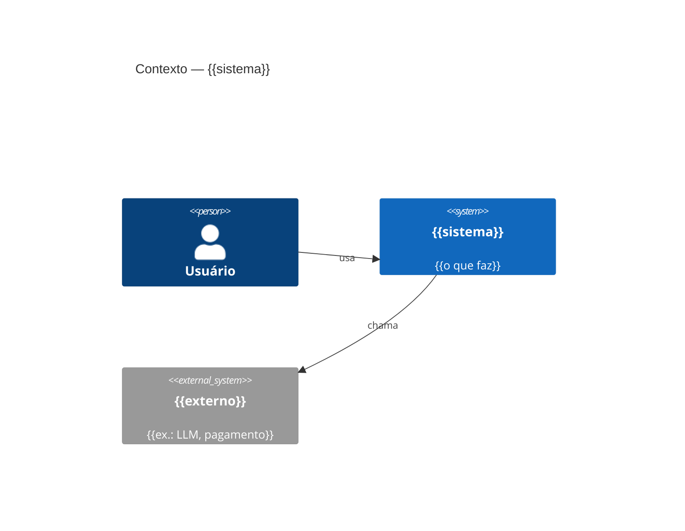

# Tech Discovery Brief — {{Nome do sistema/feature}}

**Status:** Rascunho
**Data:** {{YYYY-MM-DD}}
**Autor:** {{nome}} (via tech-discovery)
**Slug:** {{slug}}   <!-- reusar em prd-<slug>, technical-decisions-<slug>, phase-NN-<slug> -->
**Entrada:** [[discovery-{{slug}}]] / [[prd-{{slug}}]]

## 1. Contexto & restrições
{{Problema validado (resumo), escopo, e as RESTRIÇÕES que podam o espaço: stack atual, time,
ambiente de deploy, orçamento (incl. IA/LLM), compliance.}}

## 2. NFRs (alvos mensuráveis)
| Atributo | Alvo | Fonte |
|---|---|---|
| Performance | {{p95 < … a … RPS}} | {{PRD / (a confirmar)}} |
| Escala | {{RPS, crescimento de dados}} | |
| Disponibilidade | {{99.x% + degradação graciosa}} | |
| Custo | {{< $X/mês; < $Y/1k chamadas IA}} | |
| Segurança | {{ver §6}} | |

## 3. Opções de arquitetura & decisão
### Decisão D1 — {{tema}}
- **Opção A:** {{como funciona}} — prós / contras
- **Opção B:** {{…}} — prós / contras
- **Recomendação:** {{A}} — {{justificativa pelo contexto/NFR}}
- **Decisão:** _{{a preencher}}_
{{repetir para decisões maiores}}

## 4. Visão C4 (mermaid)

{{+ diagrama de Containers; bounded contexts e responsabilidades.}}

## 5. Modelo de dados & integrações
```mermaid
erDiagram
  {{ENTIDADE_A ||--o{ ENTIDADE_B : "rel"}}
```
- **Ownership por contexto:** {{entidade → contexto dono}}
- **Storage:** {{escolha por classe de dado + padrão de acesso que justifica}}
- **Consistência:** {{forte/eventual — onde}}
- **Integrações:** {{dependência → contrato · sync/async · falha (retry/idempotência) · auth}}
- **Migração de dados:** {{plano + rollback, se aplicável}}

## 6. Segurança (STRIDE)
- **AuthN/AuthZ:** {{modelo + isolamento de tenant}}
- **Dados sensíveis:** {{classificação + proteção + compliance}}
| Boundary | Ameaça STRIDE | Controle |
|---|---|---|
| {{público→app}} | {{ex.: Information disclosure / cross-tenant}} | {{tenant scoping central}} |
- **Requisitos de segurança (testáveis):** {{→ viram critérios de aceite no PRD}}

## 7. Estimativas (escala & custo)
{{Carga (RPS médio/pico), dados (storage/ano), 1º gargalo. Custo mensal por driver, IA incluída,
e sanity-check de margem vs ACV.}}

## 8. Riscos & spikes (risk-first)
| Risco/incógnita | Impacto × incerteza | Spike (objetivo · time-box · aceite) | Desbloqueia |
|---|---|---|---|
| {{…}} | {{alto/alto}} | {{1 dia · decisão/PoC}} | {{D1}} |

**Walking skeleton:** {{a fatia ponta-a-ponta a construir primeiro}}

## 9. Seed ADRs (decisões irreversíveis)
| ADR proposto | Decisão | Racional |
|---|---|---|
| {{0001-…}} | {{…}} | {{…}} |

## 10. Handoff
- **Decidido (→ prd-creator):** {{…}}
- **Forks granulares (→ research):** {{ex.: lib X vs Y}}
- **Rodar primeiro:** {{spike/walking skeleton}}
- **Premissas em aberto:** {{(a confirmar)}}

## Apêndice — fontes
{{Frameworks/docs consultados (com data) — para re-grounding futuro.}}
