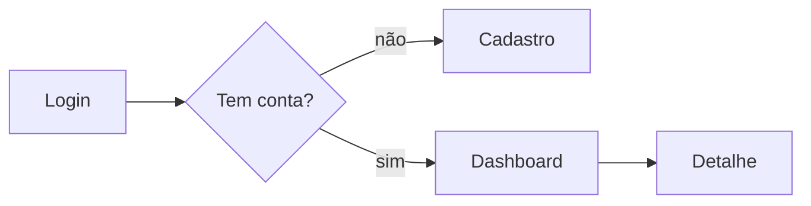

# Design Process — IA, flows, screen specs

Turn the validated vision into UI. Work top-down: structure (IA) → motion (flows) → detail
(screen specs). Ground every screen in a feature/requirement — no orphan screens.

## Information architecture (the screen inventory)

From the features (P0/P1/P2) and journeys, list the screens and how they're organized.
- One screen per distinct user goal/state; don't merge two goals into one busy screen.
- Group into nav areas (top-level sections); note auth-gated vs public.
- **Map each screen → the feature/requirement it serves.** Keep this mapping — it's what the
  implementation plan consumes. A feature with no screen, or a screen with no feature, is a gap.
- Note shared/global UI (nav, header, toasts, modals) once.

## User flows

A flow is the screen sequence for one journey. Draw with mermaid:

Cover the **happy path + key branches** (not-logged-in, empty data, error, permission denied).
Flows expose missing screens — the confirmation, the empty state, the error — that the IA missed.
Do one flow per core journey from the brief.

## Screen spec (per screen)

The durable contract a developer builds from:
- **Purpose** — the one job this screen does (and which feature/requirement).
- **Layout** — regions (header / content / sidebar / actions), roughly. A small ASCII sketch helps.
- **Components** — the concrete elements (form fields, table, cards, buttons), with their data.
- **Content** — real labels/copy where it matters (PT-BR if the product is PT-BR).
- **States** — design **every** state, not just the happy one:
  - empty (no data yet) · loading · error (and the message) · success · permission-denied ·
    partial/edge (long text, many items, zero results).
- **Actions & transitions** — what each action does and which screen it leads to (ties back to
  the flow).

> The states list is where most designs are thin. A spec that only shows the populated happy
> path forces the developer to invent the empty/error UX — design it here.

## Responsive / platform

State the target up front (desktop-first management tool? mobile-first consumer app?). For each
screen note how it adapts (stack on mobile, hide secondary nav, etc.) only where it's non-obvious.

## Anti-patterns

- Designing screens the features don't need (scope creep) — every screen maps to a requirement.
- Skipping empty/error states.
- One mega-screen doing many jobs.
- Inventing product requirements here — if the design reveals a missing requirement, flag it for
  the PRD; don't silently add scope.
